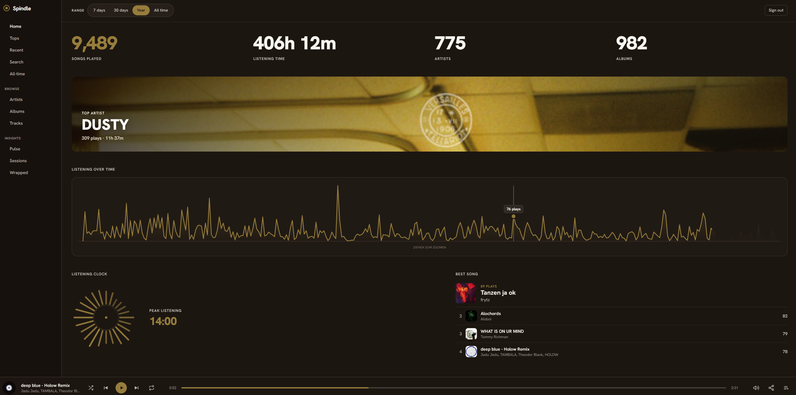
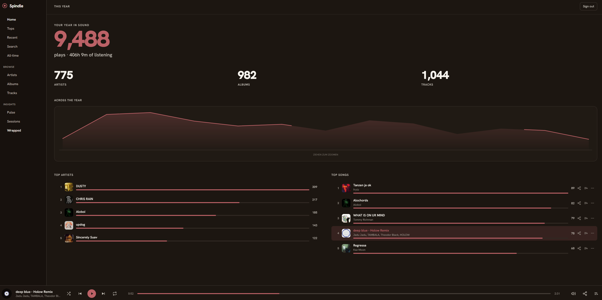
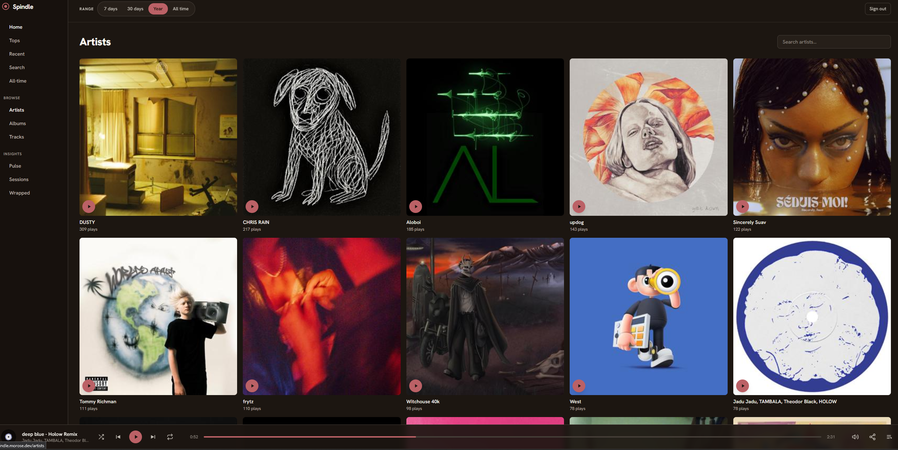

# Spindle

Listening stats for your own Navidrome server. Think Last.fm or Spotify Wrapped, except the data is yours and it lives right next to your music.

I self-host Navidrome and always missed having real stats. Last.fm scrobbling sort of works, but the site feels ancient and my history isn't really mine. So I built this. It watches what you play, keeps the history in its own little SQLite database, and turns it into top artists/albums/tracks, when you actually listen (an hour-of-day clock and a weekday heatmap), your listening sessions, an all-time view, and a year in review. The whole interface recolors itself from the cover art of whatever you've been playing, which I'm probably too proud of.

It sits behind a password, so it's fine to put on a real domain.

## Screenshots

<p align="center">
  <br>
  <sub>Home: headline numbers, top artist, listening over time, and the hour-of-day clock</sub>
</p>

<table>
  <tr>
    <td width="50%" align="center"><br><sub>Your year in review</sub></td>
    <td width="50%" align="center"><br><sub>Browsing the library (artist view)</sub></td>
  </tr>
</table>

The accent recolors itself from the cover art, so each of these is a different shade.

## What you get

- A home dashboard with your headline numbers, top artist, and current favourite song
- Tops: artists / albums / tracks, sort by plays or by time, with a filter
- Browse the whole library and click into any artist, album, or track for its own page (rank, first/last play, a history chart, related tracks)
- Pulse: a weekday by hour heatmap and a record-shaped listening clock
- Sessions: your listening cut into actual sittings, newest or longest first
- Recent: a plain feed of what you played, grouped by day
- An all-time view and a Spotify-Wrapped style year page
- A built-in player, so you can actually play things without leaving the page. Queue, shuffle, repeat, volume, media keys, all streamed straight from Navidrome. Plays from it scrobble back to Navidrome too, so they show up in your stats like anything else
- Share links: hand someone a track, an album, or your whole queue on a link that dies after 24 hours. The share page is rendered on the server, so it survives being opened inside Discord or Instagram's in-app browser
- Search across your whole library
- If more than one person uses your Navidrome, a switcher flips between their stats

## How it works

Three small pieces:

- a Navidrome scrobble plugin ([`plugin/`](plugin/)) that POSTs every play to the backend
- the backend (Fastify + SQLite) that stores those plays and computes the stats on the fly. It reads your `navidrome.db` read-only for track/artist/album info and cover-art ids, and proxies the actual images and audio from Navidrome
- the frontend (Vue 3 + Vite + Tailwind). The charts are all hand-rolled SVG, no chart library

Every play has a source. `baseline` is your existing Navidrome play counts, imported once so day one isn't a blank page (counts only, no real timestamps). `live` is new scrobbles coming in. `import` is history you brought from Spotify or Last.fm (below). Anything time-based skips `baseline`, since those plays don't have a real timestamp to put on a clock.

The ingest side is just a `POST /ingest` with a shared secret, so if you don't want the plugin you can point anything that knows your scrobbles at it.

## Running it

It's one Docker image: the frontend gets built and served together with the API, and I publish it to `ghcr.io/xmorose/spindle` so you don't have to clone the repo or build anything. The easy path is a `docker compose` service sitting next to your Navidrome container, with your `navidrome.db` mounted (Spindle only ever reads it) and a shared secret between the plugin and the backend.

You really just need two files next to each other — the example compose and the env template (copy them out of the repo, or paste them straight into something like Portainer):

```bash
cp docker-compose.example.yml docker-compose.yml   # edit the two CHANGE-ME lines
cp backend/.env.example spindle.env                # fill in the secrets
docker compose up -d
```

If you'd rather build it yourself, uncomment `build: .` in the compose and run with `--build`.

The full walkthrough (env vars, reverse proxy, Let's Encrypt) is in [docs/DEPLOY.md](docs/DEPLOY.md). The short version of what you need:

- your Navidrome data dir mounted (Spindle opens the db read-only at the connection level) for metadata + cover art
- `DEFAULT_USER` set to your Navidrome username — that's whose stats load first
- the scrobble plugin installed in Navidrome, pointed at the backend with a matching `INGEST_SECRET`
- a login password — generate the hash with `docker run --rm ghcr.io/xmorose/spindle:latest node dist/auth/hash-cli.js "your passphrase"` (no clone needed; or `npm run hash-password` from a checkout)
- `NAVIDROME_URL` / user / password if you want cover art, the in-app player, and share links

Local dev is just `npm install` + `npm run dev` in `backend/` and `web/` (Vite proxies `/api` to the backend). You'll need Node 20+ and a copy of a `navidrome.db`.

## Bringing your history with you

A few ways to not start from scratch:

- the baseline import runs on first boot and pulls your existing Navidrome play counts
- if you have a Spotify **Extended Streaming History** export, `import-spotify` matches it against your library by artist + title (it deals with `feat.`, remixes, `- Remastered` tails, and the usual tagging mess), then inserts the matched plays with their real timestamps
- `import-lastfm` does the same from a Last.fm CSV export

Both importers are dry runs until you pass `--commit`, they write a report of what matched and what didn't, and they're reversible. There's a playlist importer too that turns your Spotify playlist exports into Navidrome `.m3u8` files.

For me that backfilled about 76k real plays going back years, which is what makes the year view and the clocks actually interesting.

## Pulling stats into another dashboard

Set `SPINDLE_READ_TOKEN` to a long random string and you can read the stats endpoints with a bearer token instead of a session cookie, without turning the login gate off:

```bash
curl -H "Authorization: Bearer $SPINDLE_READ_TOKEN" \
  "https://spindle.example.com/api/totals?range=30d"
```

That covers `/api/totals`, `/api/tops/*`, `/api/timeseries`, `/api/heatmap`, `/api/sessions`, `/api/recent`, `/api/search`, `/api/users`, `/api/entity/*`, `/api/album/*/tracks` and `/api/cover/*`. GET only, and everything else still needs a real login.

As a [homepage](https://gethomepage.dev) custom API widget:

```yaml
- Spindle:
    icon: mdi-music
    href: https://spindle.example.com
    widget:
      type: customapi
      url: https://spindle.example.com/api/totals?range=30d
      headers:
        Authorization: Bearer your-token-here
      mappings:
        - field: plays
          label: Plays
        - field: seconds
          label: Listening
          format: duration
        - field: avgPlaysPerActiveDay
          label: Per day
          format: float
```

`range` takes `7d`, `30d`, `year` or `all`, and `?user=` picks whose stats you get. The token is read-only but it isn't scoped to one user, so treat it like a password.

## Stack

Backend is Node, Fastify, better-sqlite3, and zod. Frontend is Vue 3, Vite, Tailwind v4, Pinia, TypeScript. The plugin is Rust compiled to WASM. It all builds into one Docker image and runs behind nginx on my server.

## Heads up

This is a personal project built around my own setup, so it assumes a Navidrome instance you control. One password guards the whole thing rather than per-person logins, which means anyone who can get in can switch to any user's stats — fine for a household, not what you want for strangers. It runs great for me, but I'm not selling it as a polished product. If you self-host Navidrome and want your own stats, go for it, and PRs are welcome if you build something neat on top of it.
